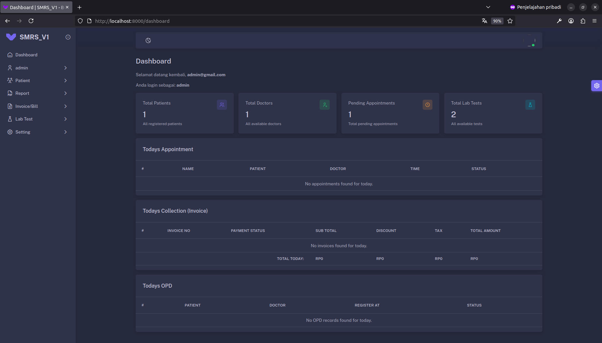

# Sistem Manajemen Rumah Sakit (SMRS V1)


[](https://opensource.org/licenses/MIT)

<p align="center">
  
</p>

Sistem Manajemen Rumah Sakit (SMRS) ini adalah aplikasi web komprehensif yang dibangun menggunakan Laravel untuk membantu mengelola berbagai aspek operasional klinik atau rumah sakit. Aplikasi ini dirancang untuk mendigitalkan proses, meningkatkan efisiensi, dan menyediakan data yang terpusat untuk pasien, dokter, dan staf administrasi.

---

## Daftar Isi

1.  [Fitur Utama](#fitur-utama)
2.  [Struktur Menu & Hak Akses per Peran](#struktur-menu--hak-akses-per-peran)
3.  [Teknologi yang Digunakan](#teknologi-yang-digunakan)
4.  [Tangkapan Layar](#tangkapan-layar)
5.  [Panduan Instalasi](#panduan-instalasi)
6.  [Cara Penggunaan](#cara-penggunaan)
7.  [Lisensi](#lisensi)

---

## Fitur Utama

Berikut adalah penjelasan lebih detail mengenai fungsionalitas utama yang tersedia dalam sistem ini:

- **Manajemen Pasien**:

  - **Pendaftaran & Profil**: Staf dapat mendaftarkan pasien baru dengan data lengkap (nama, alamat, kontak, tanggal lahir, dll.). Setiap pasien memiliki profil yang dapat dilihat dan diperbarui.
  - **Pencarian Cepat**: Memudahkan pencarian pasien berdasarkan nama, ID, atau nomor telepon untuk akses data yang cepat.

- **Manajemen Janji Temu (Appointment)**:

  - **Penjadwalan**: Staf dapat membuat janji temu baru untuk pasien dengan dokter tertentu pada tanggal dan waktu yang spesifik.
  - **Manajemen Status**: Melihat daftar janji temu harian/mingguan dan mengubah statusnya (misalnya, dari 'Tertunda' menjadi 'Dikonfirmasi' atau 'Selesai').

- **Manajemen Staf & Dokter**:

  - **Database Terpusat**: Admin dapat mengelola data semua karyawan dan dokter, termasuk informasi pribadi, kontak, dan departemen.
  - **Spesialisasi & Jadwal**: Mengatur informasi spesifik dokter seperti spesialisasi, biaya konsultasi, dan hari kerja.

- **Modul Faktur & Tagihan (Billing)**:

  - **Pembuatan Faktur Dinamis**: Kemampuan untuk membuat tagihan untuk berbagai jenis transaksi, termasuk **OPD Invoice** (konsultasi dokter), **Service Bill** (tindakan medis), dan **Package Invoice** (paket tes lab).
  - **Kalkulasi Otomatis**: Sistem secara otomatis menghitung subtotal, diskon, dan pajak berdasarkan pengaturan yang ada, meminimalkan kesalahan manual.

- **Modul Laboratorium**:

  - **Manajemen Master Tes**: Admin dapat menambah, mengedit, atau menonaktifkan jenis tes yang tersedia di laboratorium.
  - **Pengelolaan Referensi**: Mengatur nilai rujukan normal, unit, dan parameter lain untuk setiap tes, memastikan hasil yang akurat.
  - **Pembuatan Laporan**: Petugas lab dapat memasukkan hasil tes dan sistem akan menghasilkan laporan dalam format yang siap untuk dicetak atau dilihat oleh dokter.

- **Sistem Pelaporan**:

  - **Laporan Pendapatan**: Admin dapat melihat laporan pendapatan total berdasarkan rentang tanggal, pengguna (kasir), atau jenis layanan/faktur.
  - **Filter Lanjutan**: Laporan dapat difilter untuk analisis yang lebih mendalam, membantu dalam pengambilan keputusan bisnis.

- **Manajemen Pengguna & Hak Akses**:

  - **Berbasis Peran**: Menggunakan `spatie/laravel-permission`, Admin dapat membuat peran baru (Dokter, Perawat, Resepsionis, dll.) dan menetapkan izin spesifik untuk setiap menu.
  - **Keamanan Akses**: Memastikan setiap pengguna hanya dapat melihat dan melakukan aksi yang sesuai dengan tanggung jawab pekerjaannya.

- **Pengaturan Umum**:
  - **Konfigurasi Sistem**: Halaman khusus untuk Admin mengkonfigurasi parameter dasar seperti nama rumah sakit, alamat, logo, dan persentase pajak yang berlaku untuk semua transaksi.

---

## Struktur Menu & Hak Akses per Peran

Berikut adalah rincian menu yang dapat diakses oleh setiap peran utama dalam sistem. Peran **Admin** memiliki akses ke semua menu.

### Peran: Dokter

Fokus pada data klinis pasien dan jadwal pribadi.

| Menu Utama    | Sub-Menu          | URL Path                                |
| :------------ | :---------------- | :-------------------------------------- |
| **Dashboard** | -                 | `/dashboard`                            |
| **Patient**   | Patient Table     | `/dashboard/patient/patients`           |
|               | Appointment Table | `/dashboard/patient/appointments`       |
| **Lab Test**  | Examination Test  | `/dashboard/lab-test/examinations`      |
|               | Hematologi Test   | `/dashboard/lab-test/haematology-test`  |
|               | Microbiology Test | `/dashboard/lab-test/microbiology-test` |
|               | Report            | `/dashboard/lab-test/reports`           |
|               | Stain Test        | `/dashboard/lab-test/stain-tests`       |

### Peran: Perawat

Fokus pada data pasien dan jadwal departemen.

| Menu Utama    | Sub-Menu          | URL Path                          |
| :------------ | :---------------- | :-------------------------------- |
| **Dashboard** | -                 | `/dashboard`                      |
| **Patient**   | Patient Table     | `/dashboard/patient/patients`     |
|               | Appointment Table | `/dashboard/patient/appointments` |
| **Lab Test**  | Report            | `/dashboard/lab-test/reports`     |

### Peran: Staf Administrasi / Resepsionis

Fokus pada pendaftaran, penjadwalan, dan transaksi keuangan.

| Menu Utama       | Sub-Menu          | URL Path                                         |
| :--------------- | :---------------- | :----------------------------------------------- |
| **Dashboard**    | -                 | `/dashboard`                                     |
| **Patient**      | Patient Table     | `/dashboard/patient/patients`                    |
|                  | Appointment Table | `/dashboard/patient/appointments`                |
| **Report**       | OPD Reports       | `/dashboard/reports/opd`                         |
|                  | Package Reports   | `/dashboard/reports/packages`                    |
|                  | Service Reports   | `/dashboard/reports/service-report`              |
| **Invoice/Bill** | All Report        | `/dashboard/invoice-bill/all-invoice-report`     |
|                  | OPD Invoice       | `/dashboard/invoice-bill/opd-invoice/create`     |
|                  | Package Invoice   | `/dashboard/invoice-bill/package-invoice/create` |
|                  | Service Bill      | `/dashboard/invoice-bill/service-bill/create`    |

---

## Teknologi yang Digunakan

Berdasarkan file `composer.json` proyek ini, berikut adalah teknologi dan paket utama yang digunakan:

- **Backend**: Laravel 12, PHP 8.2+
- **Frontend**: Vite, Blade, Bootstrap 5, SASS, JavaScript
- **Database**: MySQL / MariaDB
- **Paket Utama**:
  - `spatie/laravel-permission`: Untuk Manajemen Role & Hak Akses.
  - `laravel/sanctum`: Untuk autentikasi API (jika digunakan).
  - `barryvdh/laravel-dompdf` (disarankan): Untuk Generate PDF Laporan.

---

## Tangkapan Layar

### Dashboard


### Modul Admin

|                                  Departemen                                   |                                  Dokter                                   |
| :---------------------------------------------------------------------------: | :-----------------------------------------------------------------------: |
|  |  |
|                                  **Pegawai**                                  |                                 **Paket**                                 |
|     |   |
|                                  **Layanan**                                  |                                                                           |
|     |                                                                           |

### Modul Pasien

|                                   Tabel Pasien                                    |                                Tabel Janji Temu                                 |
| :-------------------------------------------------------------------------------: | :-----------------------------------------------------------------------------: |
|  |  |

### Modul Laporan

|                                   Laporan OPD                                   |                                   Laporan Paket                                   |                                   Laporan Layanan                                   |
| :-----------------------------------------------------------------------------: | :-------------------------------------------------------------------------------: | :---------------------------------------------------------------------------------: |
|  |  |  |

### Modul Faktur / Tagihan

|                                   Laporan Semua Faktur                                    |                                      Faktur OPD                                      |
| :---------------------------------------------------------------------------------------: | :----------------------------------------------------------------------------------: |
|  |       |
|                                     **Faktur Paket**                                      |                                 **Tagihan Layanan**                                  |
|          |  |

### Modul Tes Lab

|                                   Tes Pemeriksaan                                    |                                    Tes Hematologi                                     |
| :----------------------------------------------------------------------------------: | :-----------------------------------------------------------------------------------: |
|  |    |
|                                  **Manajemen Tes**                                   |                                 **Tes Mikrobiologi**                                  |
|    |  |
|                                   **Laporan Lab**                                    |                                     **Tes Noda**                                      |
|      |          |
|                                  **Referensi Tes**                                   |                                                                                       |
|    |                                                                                       |

### Modul Pengaturan

|                                    Manajemen Pengguna                                    |                                    Pengaturan RS                                    |                                    Manajemen Peran                                    |
| :--------------------------------------------------------------------------------------: | :---------------------------------------------------------------------------------: | :-----------------------------------------------------------------------------------: |
|  |  |  |

---

## Panduan Instalasi

Ikuti langkah-langkah berikut untuk menjalankan proyek ini di lingkungan lokal Anda.

### Prasyarat

- PHP >= 8.2
- Composer
- Node.js & NPM
- Server Database (MySQL/MariaDB)

### Langkah-langkah Instalasi

1.  **Clone repository ini:**

    ```bash
    git clone [https://github.com/aarspacetsd/smrs_v1.git](https://github.com/aarspacetsd/smrs_v1.git)
    cd smrs_v1/SMRS_V1-backend
    ```

2.  **Install dependensi PHP:**

    ```bash
    composer install
    ```

3.  **Install dependensi JavaScript:**

    ```bash
    npm install
    ```

4.  **Buat file `.env`:**
    Salin file `.env.example` menjadi `.env`.

    ```bash
    cp .env.example .env
    ```

5.  **Konfigurasi Database:**
    Buka file `.env` dan sesuaikan pengaturan database Anda (`DB_DATABASE`, `DB_USERNAME`, `DB_PASSWORD`).

6.  **Generate Application Key:**

    ```bash
    php artisan key:generate
    ```

7.  **Jalankan Migrasi Database:**
    Perintah ini akan membuat semua tabel yang diperlukan di database Anda.

    ```bash
    php artisan migrate
    ```

8.  **(Opsional) Jalankan Seeder:**
    Jika Anda memiliki data awal (dummy data), jalankan seeder.

    ```bash
    php artisan db:seed
    ```

9.  **Compile Aset Frontend:**
    ```bash
    npm run dev
    ```

---

## Cara Penggunaan

1.  **Jalankan server pengembangan Laravel:**

    ```bash
    php artisan serve
    ```

    Aplikasi akan berjalan di `http://127.0.0.1:8000`.

2.  **Akses Aplikasi:**
    Buka browser dan kunjungi `http://127.0.0.1:8000`.

3.  **Akun Default:**
    Anda bisa login menggunakan akun default berikut (jika Anda menjalankan seeder):
    - **Admin**:
      - Email: `admin@example.com`
      - Password: `password`
    - **Dokter**:
      - Email: `doctor@example.com`
      - Password: `password`

---

## Lisensi

Proyek ini dilisensikan di bawah Lisensi MIT. Lihat file `LICENSE` untuk detail lebih lanjut.
